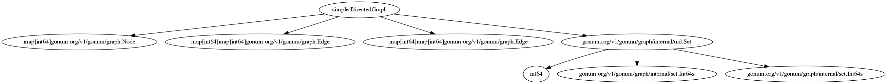

GoGraph
=======

GoGraph builds graphs out of Go source code.

GoGraph currently only works with Structs.

Install
-------

```bash
go get -u github.com/tbpg/gograph
```

Examples
------

Analyze a type from command line:
```bash
gograph -type gonum.org/v1/gonum/graph/simple.DirectedGraph | dot -Tpng -o out.png
```

Run a server:
```bash
gograph -http :8080
```



Questions
---------

File a bug or reach out on [Twitter](http://twitter.com/tbpalsulich).

Disclaimer
----------

This is not an official Google product.